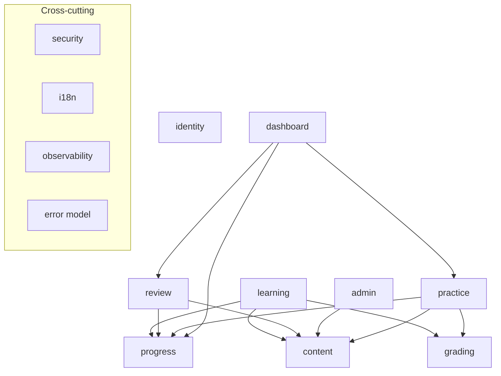
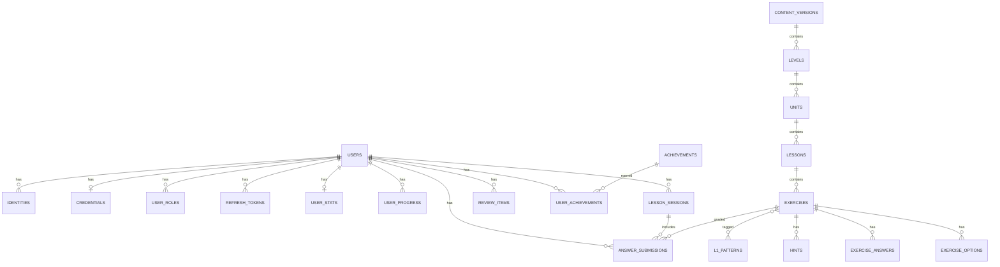
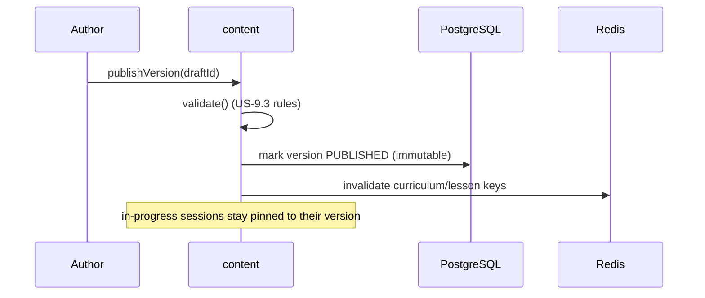
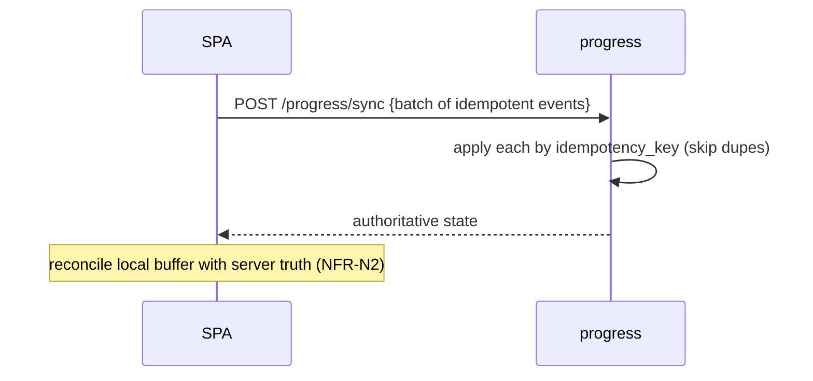

# 41 — Architecture: Low-Level Design (LLD)

**Project:** Shikhi (শিখি — "I learn")
**Document type:** Low-Level Design
**Author role:** Architect
**Status:** DRAFT — Phase B; reviewed at **Gate B**
**Version:** 0.1
**Builds on:** `40-architecture-hld.md` (and `00`–`30`)

> **How to read this (for a non-specialist):** The HLD showed the big pieces. The LLD
> zooms in: the **modules' internal responsibilities and interfaces**, the **data model**
> (what we store and how it relates), the **step-by-step flows** for the important
> operations, and the rules for **grading, caching, idempotency, and errors**. This is the
> blueprint developers build from; it also feeds the API contract (doc 43) and the DB
> migrations (Phase D). Diagrams use Mermaid.

---

## 1. Module boundaries & dependencies

Modules are **in-process** but strictly separated (enforced via Spring Modulith). A module
exposes an **application-service interface**; other modules call *only* that interface,
never each other's data.



**Dependency rules (enforced):**
- `identity` depends on nothing else (foundational).
- `content` is read by `learning`, `review`, `admin`; only `admin`/authoring writes it.
- `learning` orchestrates a session: reads `content`, calls `grading`, updates `progress`.
- `progress` is self-contained (owns XP/streak/hearts/sync); no upward dependencies.
- `grading` is pure/stateless per call; depends only on its input context.
- `practice` (E12) reads `content`'s vocabulary, calls `progress`, and reuses `grading`'s
  answer normalizer; only `dashboard` depends on `practice` (read-only, E13).
- `dashboard` (E13) is a **top-of-graph read-only composer** like `learning`: it calls
  `progress`, `practice`, and `review` application services and **never writes**.
- No module accesses another module's tables directly (only via interfaces) — with one
  sanctioned exception: the **reporting seam** below.

**Reporting seam (E13, sanctioned exception):** `dashboard` owns a read-only query
repository that runs **aggregate SQL across other modules' tables** (answer submissions,
practice answers/sessions, user progress) — a CQRS-style read model for lifetime totals
and time-series reports. Rationale: threading five one-line COUNT methods through three
owning modules adds coupling without adding safety; a single, clearly-labelled read-only
reporting repository is more honest. Constraints: **SELECT-only**, no entity mappings from
other modules (scalar projections), and any new table it touches must be listed in §2.9.
If per-day aggregation ever gets hot, the recorded evolution is a daily rollup table
owned by `dashboard` (see §2.9) — "measure then scale" (NFR R9).

---

## 2. Module internals (responsibilities & key interfaces)

### 2.1 identity
- **Responsibilities:** registration/login for email+password, phone+OTP, Google OAuth;
  token issue/refresh/revoke; profile; roles; account deletion/export.
- **Key interfaces (conceptual):**
  - `AuthenticationService` — `register`, `login`, `verify`, `refresh`, `logout`.
  - `IdentityProvider` (abstraction, D5) — implementations: `EmailPasswordProvider`,
    `PhoneOtpProvider`, `GoogleOAuthProvider`.
  - `AccountService` — profile, link identity, delete/export.
- **Notes:** password hashing with a strong adaptive algorithm (Argon2/bcrypt — ADR-0005);
  refresh-token rotation with replay detection; OTP + rate-limit state in Redis.

### 2.2 content
- **Responsibilities:** curriculum tree (levels→units→lessons→exercises), authoring,
  validation, versioning, publish; serves cached published content to learners.
- **Key interfaces:**
  - `CurriculumQueryService` — `getPublishedTree`, `getLesson(lessonId, versionId)`.
  - `AuthoringService` — draft CRUD, `validate`, `publishVersion`, `rollback`.
- **Notes:** published `ContentVersion`s are immutable; publish invalidates cache.

### 2.3 learning
- **Responsibilities:** run a lesson session; deliver exercises; accept answers; coordinate
  grading + progress updates; produce results.
- **Key interfaces:** `LessonSessionService` — `start(lessonId)`, `submitAnswer(cmd)`,
  `complete(sessionId)`.

### 2.4 grading (the AI seam — D4/NFR-M6)
- **Core type — `GradingStrategy`:**
  `GradingVerdict grade(GradingContext ctx)`
  - `GradingContext` = exercise (type, accepted answers, options/tokens, pattern tags,
    hints) + learner answer + locale.
  - `GradingVerdict` = `{ correct: bool, feedback: Bilingual, matchedPatternCode?: string,
    confidence?: number, source: enum(RULE|AI) }`.
- **v1 implementation:** `RuleBasedStrategy` only.
- **Composition for the future (decorator pattern, no player changes):**
  `CachingStrategy( FallbackStrategy( AiStrategy, RuleBasedStrategy ) )` — cache first, AI
  next, rule-based fallback. Selected by `GradingService` per exercise type/config.
- **Guarantee:** the **verdict shape never changes**, so `learning`/`progress` are
  untouched when AI is added (SC-5).

### 2.5 progress
- **Responsibilities:** XP, hearts, streak, unlocking, achievements, **idempotent** answer
  recording and cross-device sync.
- **Key interfaces:** `ProgressService` — `recordAnswer(idempotentCmd)`,
  `completeLesson(idempotentCmd)`, `getState(userId)`, `syncBatch(idempotentBatch)`,
  `recordPracticeAnswer(userId, correct)` (E12), `setLevel(userId, cefrLevel)` (E12).

### 2.6 review
- **Responsibilities:** maintain per-learner review items; schedule (Leitner boxes);
  produce review sessions.
- **Key interfaces:** `ReviewService` — `onMissed(userId, exerciseId)`, `getDue(userId)`,
  `recordReviewResult(...)`.

### 2.7 admin/ops
- **Responsibilities:** authoring UI surfaces (via `content`), health/readiness,
  operational/role-gated actions.

### 2.8 practice (adaptive vocabulary sessions — E12)
- **Responsibilities:** generate CEFR-matched practice exercises from the vocabulary layer
  (V11); run continuous round-based sessions; track per-word strength; grade its own
  generated items (answer key stored server-side, same "correctness never leaves the
  server" rule as `grading`); suggest level-ups.
- **Key interfaces:** `PracticeSessionService` — `start(userId)`, `submitAnswer(cmd)`
  (idempotent), `nextRound(sessionId)`, `complete(sessionId)`;
  `PracticeGenerator` — pure selection + templating over vocabulary rows.
- **Generation rules:**
  - **Word pick:** ~70% current band / ~30% earlier bands; priority low-strength → unseen
    → random; no word repeats within one session; distractors drawn from the same band
    (same part of speech when possible).
  - **Formats:** `WORD_MEANING` (EN→BN MCQ), `MEANING_WORD` (BN→EN MCQ), `SENTENCE_GAP`
    (blanked example sentence, MCQ), `SENTENCE_BUILD` (word-bank over the EN example, only
    when ≤ ~8 tokens), `TYPE_WORD` (typed EN headword). Per round ≈ 60% word-level / 40%
    sentence-level.
  - Generated items are persisted (payload without correctness + server-only answer key)
    so grading and idempotent replay work exactly as in `learning`.
- **Level:** the learner's CEFR level lives on `user_stats` (owned by `progress`);
  `practice` reads it via `ProgressService` and computes `levelUpEligible` (distinct words
  answered correctly ≥ 60% of the current band, level < B2). Promotion is always
  user-confirmed (`PUT /stats/level`).
- **Gamification:** delegates to `ProgressService.recordPracticeAnswer(userId, correct)` —
  day activity/streak, heart on wrong, `XP_PER_CORRECT` on right (practice has no
  lesson-completion XP event).

### 2.9 dashboard (learner profile & dashboard — E13)

- **Responsibilities:** compose the learner-facing dashboard snapshot (`GET /dashboard`)
  and activity reports (`GET /reports/activity`) from data the other modules already own.
  **Read-only**: it never mutates state; profile *edits* stay in `identity` (`PATCH /me`).
- **Key interfaces:**
  - `DashboardService` — `snapshot(userId)`: `{ stats (via ProgressService.getState),
    wordMastery[] per band A1–C1 (via practice), reviewDueCount (via
    ReviewService.dueCount), lessonsCompleted, practiceSessionsCompleted, totalAnswered,
    totalCorrect, accuracyByPattern }`.
  - `ReportsService`/same service — `activity(userId, days)`: per-UTC-day
    `{date, answered, correct}` for the last *n* days (default 30, max 90).
- **Composition seams added in owning modules (thin, service-level):**
  - `review`: `ReviewService.dueCount(userId)`.
  - `practice`: `PracticeStatsService.masteryByBand(userId)` — "mastered" =
    `times_correct > 0` (same semantics as level-up eligibility's
    `countMasteredInBand`); band totals from `vocabulary` counts.
- **Reporting seam queries** (the §1 sanctioned read-only repository), all scalar
  projections: lifetime answered/correct = UNION ALL over `answer_submissions` +
  `practice_answers`; per-day buckets = same union grouped by UTC day; completed counts
  from `user_progress` / `practice_sessions`; `accuracyByPattern` grouped over
  `answer_submissions.matched_pattern_code`. Day boundary is **UTC**, deliberately
  matching `ProgressService.today()` (per-user timezone stays OQ-L1).
- **Derivability contract:** everything is back-derivable from existing timestamped rows —
  no new write paths, no event tables. **XP-over-time is not offered** (per-event XP was
  never recorded; practice XP is `10 × correct` but lesson XP is a lump completion award).
  If exact XP charts are wanted later, the evolution is a `dashboard`-owned daily rollup
  table populated on write — recorded here, not built (NFR R9).
- **Performance:** V22 adds `(user_id, submitted_at)` indexes on `practice_answers` and
  `answer_submissions` (§3.5a); report window capped at 90 days; the aggregate runs only
  on dashboard open, never on the hot answer path (`GET /stats` is untouched).

---

## 3. Data model (ERD)

> System of record = PostgreSQL. `JSONB` is used for type-specific exercise extras;
> everything needed for querying, grading, and integrity is normalized. Timestamps
> (`created_at`/`updated_at`) implied on all tables. IDs are UUIDs.



### 3.1 identity tables

| Table | Key columns | Notes |
|---|---|---|
| `users` | id, display_name, ui_locale (`bn`/`en`), status, deleted_at | Soft-delete for account deletion/anonymization |
| `identities` | id, user_id→users, provider (`EMAIL`/`PHONE`/`GOOGLE`), external_ref, verified_at | **UNIQUE(provider, external_ref)**; multi-method (D5) |
| `credentials` | id, user_id→users, password_hash, algo, updated_at | Only for `EMAIL`; never store plaintext |
| `user_roles` | user_id→users, role (`LEARNER`/`AUTHOR`/`ADMIN`) | AuthZ |
| `refresh_tokens` | id, user_id→users, token_hash, family_id, issued_at, expires_at, revoked_at, device_info | Rotation + replay detection (hash only) |

> OTP challenges and rate-limit counters live in **Redis** (ephemeral), not Postgres.

### 3.2 content tables (versioned)

| Table | Key columns | Notes |
|---|---|---|
| `content_versions` | id, label, status (`DRAFT`/`PUBLISHED`/`ARCHIVED`), published_at, notes | Immutable once `PUBLISHED` |
| `levels` | id, content_version_id→content_versions, code, title_en, title_bn, ordinal | |
| `units` | id, level_id→levels, code, title_en, title_bn, ordinal | |
| `lessons` | id, unit_id→units, code, title_en, title_bn, ordinal | |
| `exercises` | id, lesson_id→lessons, type, ordinal, prompt_en, prompt_bn, media_ref, config `JSONB` | `type` ∈ MCQ, MATCH, WORD_BANK, FILL_BLANK, TYPE_TRANSLATION, LISTENING |
| `exercise_options` | id, exercise_id→exercises, text_en, text_bn, is_correct, ordinal | For MCQ/MATCH |
| `exercise_answers` | id, exercise_id→exercises, accepted_answer, is_primary | For TYPE_TRANSLATION/FILL_BLANK (accepted set) |
| `hints` | id, exercise_id→exercises, trigger (`DEFAULT`/`PATTERN`/`WRONG_ANSWER`), trigger_key, text_en, text_bn | Curated bilingual feedback |
| `l1_patterns` | id, code, name_en, name_bn | Reference (articles, tense-aspect, …) |
| `exercise_patterns` | exercise_id→exercises, pattern_id→l1_patterns | M:N tags → targeted feedback & SC-3 analytics |

### 3.3 progress / gamification tables

| Table | Key columns | Notes |
|---|---|---|
| `user_stats` | user_id→users (PK), xp, rank, current_streak, longest_streak, last_active_date, hearts, hearts_updated_at, daily_goal | One row per learner |
| `user_progress` | id, user_id, lesson_id, content_version_id, status, best_score, completed_at | **UNIQUE(user_id, lesson_id, content_version_id)** |
| `lesson_sessions` | id, user_id, lesson_id, content_version_id, status, score, hearts_remaining, started_at, completed_at | A single play-through (F4 version pinning) |
| `answer_submissions` | id, user_id, exercise_id, lesson_session_id, **idempotency_key**, is_correct, submitted_answer, created_at | **UNIQUE(user_id, idempotency_key)** → no double count (NFR-DI1) |
| `achievements` | id, code, name_en, name_bn, criteria `JSONB` | Reference |
| `user_achievements` | user_id, achievement_id, earned_at | **UNIQUE(user_id, achievement_id)** |

### 3.4 review & audit tables

| Table | Key columns | Notes |
|---|---|---|
| `review_items` | id, user_id, exercise_id, box_level, due_at, last_result, updated_at | **UNIQUE(user_id, exercise_id)**; Leitner scheduling |
| `event_log` | id, user_id?, type, payload `JSONB`, correlation_id, created_at | Security-relevant + analytics events; **no sensitive payloads** (NFR-SEC9) |

### 3.5 practice tables (E12)

| Table | Key columns | Notes |
|---|---|---|
| `user_stats.cefr_level` | (column on existing table) `varchar(2)` A1–C1, default `'A1'` | The learner's self-placed / confirmed band. Check constraint widened to include C1 in V21 (`practice_sessions.cefr_level` likewise) |
| `practice_sessions` | id, user_id, cefr_level, rounds_played, correct_count, total_count, started_at, completed_at | One continuous practice run; level pinned at start |
| `practice_exercises` | id, session_id, round, ordinal, vocabulary_id, type, prompt_en, prompt_bn, payload `JSONB`, **answer_key `JSONB`**, answered_correct | `payload` is learner-visible (no correctness); `answer_key` is server-only |
| `practice_answers` | id, user_id, session_id, exercise_id, **idempotency_key**, correct, submitted_at | **UNIQUE(user_id, idempotency_key)** — same replay-safety as `answer_submissions`. *(Column names corrected 2026-07-08 to match V16: `correct`, `submitted_at`.)* |
| `practice_word_progress` | **PK(user_id, vocabulary_id)**, times_seen, times_correct, strength, last_seen_at | Drives weak-word priority + level-up eligibility |

### 3.5a reporting indexes (E13 — V22)

No new tables. `V22__reporting_indexes.sql` adds two additive indexes for the §2.9
reporting seam's per-user aggregation:

| Index | On | Serves |
|---|---|---|
| `ix_practice_answers_user_time` | `practice_answers (user_id, submitted_at)` | daily activity buckets, lifetime totals |
| `ix_answer_submissions_user_time` | `answer_submissions (user_id, submitted_at)` | daily activity buckets, lifetime totals, accuracy-by-pattern |

---

## 4. Sequence diagrams (key flows)

### 4.1 Submit answer (grading + hearts/XP, idempotent) — F1

```mermaid
sequenceDiagram
    participant SPA
    participant Learning as learning
    participant Content as content(cache)
    participant Grading as grading
    participant Progress as progress
    SPA->>Learning: POST /answers {sessionId, exerciseId, answer, idempotencyKey}
    Learning->>Content: getExercise(exerciseId, versionId)
    Content-->>Learning: exercise (from Redis cache or DB)
    Learning->>Grading: grade(GradingContext)
    Grading-->>Learning: verdict {correct, feedback, matchedPattern?}
    Learning->>Progress: recordAnswer(idempotent cmd, verdict)
    Note over Progress: UNIQUE(user, idempotencyKey) → replay-safe;<br/>update XP, hearts, streak atomically
    Progress-->>Learning: updated stats
    Learning-->>SPA: {verdict, feedback, stats}
    opt wrong answer
      Learning->>Progress: (async) enqueue review item
    end
```

### 4.2 Email login → token issue — F3

```mermaid
sequenceDiagram
    participant SPA
    participant Identity as identity
    participant Redis
    SPA->>Identity: POST /auth/login {email, password}
    Identity->>Identity: verify hash (rate-limited via Redis)
    Identity-->>SPA: {accessToken(JWT, short-lived), refreshToken(rotating)}
    SPA->>Identity: (later) POST /auth/refresh {refreshToken}
    Identity->>Identity: rotate; detect replay (family_id)
    Identity-->>SPA: new token pair
```

### 4.3 Content publish + cache invalidation — F4



### 4.4 Resilient cross-device sync — F2



---

## 5. Grading rules (v1 deterministic)

| Exercise type | Grading rule |
|---|---|
| **MCQ** | Selected option's `is_correct` = true |
| **MATCH** | All pairs matched correctly |
| **WORD_BANK** | Assembled token order equals an accepted ordering (supports word-order/SOV→SVO practice) |
| **FILL_BLANK** | Normalized answer ∈ `exercise_answers` accepted set |
| **TYPE_TRANSLATION** | Normalized answer ∈ accepted set |
| **LISTENING** | Same as MCQ or TYPE_TRANSLATION depending on response mode |

**Normalization pipeline (TYPE_TRANSLATION / FILL_BLANK):** trim → collapse internal
whitespace → case-fold → strip trailing punctuation → apply curated equivalents/variants.
**Feedback:** on wrong answer, pick hint by precedence `WRONG_ANSWER` (exact) → `PATTERN`
(from tags) → `DEFAULT`, in the learner's locale. **Validation** (US-9.3) rejects gradable
exercises with no accepted answer or (for MCQ) no correct option.

---

## 6. Caching strategy (Redis)

| Cache | Key | Invalidation |
|---|---|---|
| Published curriculum tree | `curriculum:{versionId}` | On publish/rollback |
| Lesson payload | `lesson:{versionId}:{lessonId}` | On publish/rollback |
| Rate-limit counters | `rl:{scope}:{subject}` | TTL |
| OTP challenges | `otp:{phone}` | TTL / on use |
| Ephemeral tokens (verify/reset) | `tok:{purpose}:{id}` | TTL / on use |
| (Future) AI grading results | `grade:{exerciseId}:{answerHash}` | TTL (AI phase) |

Cache miss/outage ⇒ read from Postgres (correct, slower) — graceful degradation (NFR-A3).

---

## 7. Idempotency & data integrity

- Every state-changing learner action (`recordAnswer`, `completeLesson`, `sync` events)
  carries a **client-generated idempotency key**; a `UNIQUE(user_id, idempotency_key)`
  constraint makes replays safe (NFR-A4/DI1/N2).
- XP/hearts/streak updates happen in a **single transaction** per answer to avoid partial
  updates.
- Streak logic: `current_streak` increments once per day the daily goal is met; based on
  `last_active_date` in the learner's timezone (timezone handling noted for LLD refinement).
- Hearts: decrement on wrong answer within a session; at zero, session offers review (E7).

---

## 8. Error model (consistent API)

All errors return a structured envelope:
```json
{ "code": "MACHINE_READABLE_CODE", "message": "localized human text",
  "details": { }, "correlationId": "..." }
```
- HTTP status mapping: 400 validation, 401 unauthenticated, 403 unauthorized, 404 not
  found, 409 conflict (e.g., duplicate identity), 429 rate-limited, 5xx server.
- Messages are **localized** (BN/EN); **no internal details leak** (NFR-SEC, error handling).
- `correlationId` ties the response to logs/traces (NFR-O1/O3).

---

## 9. Security touchpoints (detail in `50`)

- Server-side authorization on every request; learners restricted to their own data;
  `AUTHOR`/`ADMIN` actions role-gated.
- Input validation (Bean Validation) + output encoding.
- Rate limiting on auth/OTP/write endpoints (Redis).
- Secrets externalized; TLS enforced.

---

## 10. Mapping: modules → API areas (feeds doc 43)

| Module | API area (paths) |
|---|---|
| identity | `/auth/*`, `/me`, `/me/identities`, `/me/export`, `/me` (DELETE) |
| content | `/curriculum`, `/lessons/{id}` (learner read); `/admin/content/*` (authoring) |
| learning | `/sessions`, `/sessions/{id}/answers`, `/sessions/{id}/complete` |
| progress | `/progress`, `/progress/sync`, `/stats`, `/stats/level` |
| practice | `/practice/sessions`, `/practice/sessions/{id}/answers`, `/practice/sessions/{id}/rounds`, `/practice/sessions/{id}/complete` |
| review | `/review/due`, `/review/results` |
| dashboard | `/dashboard`, `/reports/activity` (E13, read-only) |
| ops | `/health`, `/ready` |

---

## 11. Open LLD questions (for Gate B)

- **OQ-L1:** Timezone source for streak calculation (device vs. profile setting)?
- **OQ-L2:** Refresh-token storage — DB table (shown) vs. Redis-only; rotation policy
  specifics (finalize with Security).
- **OQ-L3:** WORD_BANK multiple accepted orderings — store in `config JSONB` vs. dedicated
  table (leaning JSONB).
- **OQ-L4:** Whether `answer_submissions` retains `submitted_answer` long-term (analytics
  value vs. data-minimization NFR-PR1) — decide with Security.

> **Next:** the **ADR set** (`docs/adr/`) recording the significant decisions summarized in
> the HLD/LLD, then the **OpenAPI contract** (`43`) and the **security/privacy threat
> model** (`50`).
