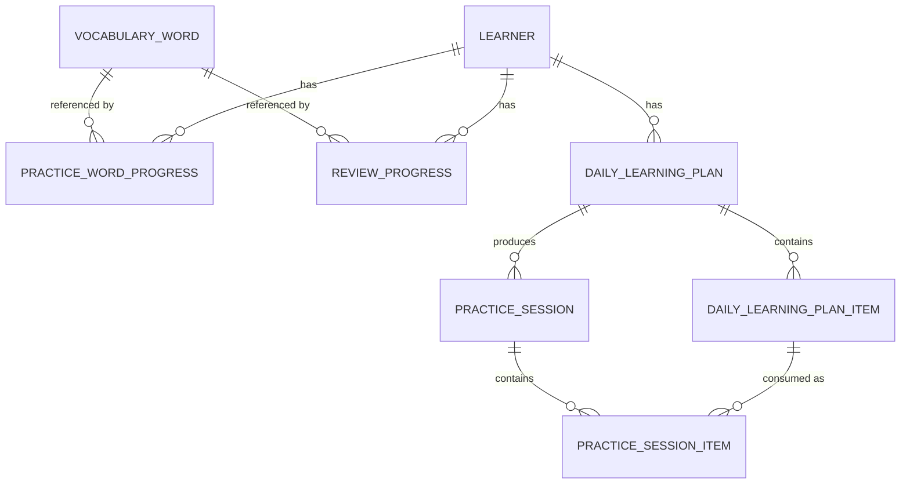

# 42 — Vocabulary Learning Engine v2: Engineering Design

**Project:** Shikhi (শিখি — "I learn")
**Document type:** Subsystem Architecture & Implementation Specification
**Author role:** Architect
**Status:** ACCEPTED (as amended by `43-vocabulary-engine-v2-implementation.md`) —
supersedes the current strength-ranked practice picker (E12); the Leitner lesson
scheduler (M6) is retained per doc 43 §4.1
**Version:** 2.0
**Audience:** Backend engineers, AI coding agents, product owners
**Builds on:** `40-architecture-hld.md`, `41-architecture-lld.md` (`learning`/`practice`/
`progress` module boundaries), `30-nfr.md`

> **How to read this:** This document consolidates a seven-part design exploration into one
> buildable spec. Where later analysis in that exploration changed an earlier decision, this
> document states only the **final** decision; the discarded alternatives and the reasoning
> for changing course are kept in **§13 Superseded Alternatives** so the "why" isn't lost.

---

## 1. Purpose

Replace the current vocabulary selection algorithm — a single `ORDER BY strength ASC,
random()` query — with a learning engine that treats three educational problems as
independent:

1. **New learning** — "What should the learner see for the first time?"
2. **Reinforcement** — "What does the learner currently struggle with?"
3. **Retention** — "What has the learner already learned but is about to forget?"

Instead of one ranked list answering all three questions at once, the system explicitly
plans each learner's daily workload, then builds practice sessions from that plan.

**Goal:** maximize long-term vocabulary retention while maintaining a steady, sustainable
pace of new-vocabulary introduction.

## 2. Current State

Today, two disconnected mechanisms exist in the already-modular backend
(`com.shikhi.{content,dashboard,identity,learning,platform,practice,progress,review}`,
each with its own `domain/repo/service/web`):

- **Practice picker (E12):** `practice/domain/PracticeWordProgress.java` (table
  `practice_word_progress`, migration `V16__practice.sql`) carries one `strength` field
  (int, default `UNSEEN_STRENGTH = 2`, clamped `0..5`; `recordAnswer(correct)` does `+1` /
  `-2`). Selection is a single native-SQL round trip in
  `practice/service/PracticeWordPicker.java`:
  `ORDER BY coalesce(p.strength, 2), random()` over `vocabulary LEFT JOIN
  practice_word_progress`, filtered by CEFR band and excluding ids already used in the
  session.
- **Lesson review (M6/E7):** a fully separate Leitner scheduler —
  `review/domain/ReviewScheduler.java` (boxes 1–5, intervals `[-, 0, 1d, 3d, 7d, 16d]`) and
  `review/domain/ReviewItem.java` (table `review_items`, migration `V7__review.sql`,
  `missed()` resets to box 1, `recalled()` promotes one box). Critically, `review_items`
  tracks **lesson exercises**, not vocabulary words — it has no relationship to
  `practice_word_progress` at all.

### 2.1 Problems this causes

| # | Problem | Cause |
|---|---|---|
| 1 | No true spaced repetition for vocabulary | `strength` conflates confidence and timing; review only exists for lesson exercises, not words |
| 2 | Mastered words disappear indefinitely | nothing re-schedules a `strength = 5` word once it stops ranking near the top |
| 3 | Unseen words dominate large CEFR bands | new words (coalesced `strength = 2`) compete unbounded against everything else in one `ORDER BY` |
| 4 | No notion of a daily workload | `PracticeWordPicker` runs fresh per session request; nothing tracks how much the learner has done today |
| 5 | Leitner review (M6) and vocabulary practice (E12) don't share state | a word can be "mastered" in `practice_word_progress` while its `review_items` row (a different entity, exercises not words) is independently due or overdue — no reconciliation between the two |

A single `ORDER BY` cannot answer three different educational questions at once — they
require different algorithms operating over different data. This document proposes
replacing both `PracticeWordPicker` and the exercise-level `ReviewScheduler`/`ReviewItem`
pair with one word-level planner + scheduler, and supersedes the practice/review sections of
`20-prd.md` (E7, E12), `40-architecture-hld.md`'s review module entry, and
`41-architecture-lld.md` §2.7/2.8/3.4/3.5.

## 3. Design Philosophy

Vocabulary learning should mimic a good human teacher, who doesn't pick words at random but
thinks: *"Today I'll teach ten new words, review yesterday's mistakes, and briefly revisit
words learned last week."*

### 3.1 Core principles

1. **New learning is intentional.** The learner receives a *planned* number of new words
   per day (e.g. 60), not "whichever unseen words happen to rank highest."
2. **Mistakes get immediate attention.** A word answered incorrectly returns quickly;
   failure temporarily overrides long-term scheduling.
3. **Mastered words never disappear forever.** Every learned word eventually becomes due
   again — the learner should keep seeing core vocabulary for years, not weeks.
4. **The learner has a daily cognitive budget.** 100 brand-new words in one day is a worse
   outcome than 60 new + 25 reinforcement + 15 review, even though both are "100 words."
5. **Scheduling and confidence are different concepts.** Knowing a word well does not mean
   it should stop appearing — confidence and review timing are independent state.

## 4. High-Level Architecture

```mermaid
flowchart TD
    L[Learner] --> DP[Daily Learning Planner]
    DP --> Plan[Daily Learning Plan\nNew / Weak / Review allocation]
    Plan --> SB[Session Builder]
    SB --> PG[Practice Generator\n(existing, unchanged)]
    PG --> Prac[Learner Practices]
    Prac --> PE[Progress Engine]
    PE --> RS[Review Scheduler]
    RS -.updates dueAt.-> Plan
    PE -.updates masteryScore.-> DP
```

The planner decides **what** should be learned today. The session builder decides **when**,
within today, each item appears. The exercise generator decides **how** a word is tested.
Each component has exactly one responsibility, and none of them call each other's internals.

### 4.1 Component responsibilities

| Component | Owns | Must NOT do |
|---|---|---|
| `DailyPlanner` | today's workload: how many new / weak / review, and which words | generate exercises, score answers, know about exercise types |
| `SessionBuilder` | turning the plan into one UI-sized batch at a time; bucket mixing, shuffling, resume | select vocabulary, schedule reviews, compute mastery |
| `PracticeGenerator` (existing) | exercise type selection (MCQ, gap-fill, typing, sentence build, meaning), distractors | anything about scheduling |
| `ProgressEngine` | updating `masteryScore`, streaks, mistake counts after every answer | scheduling reviews directly (delegates to `ReviewScheduler`) |
| `ReviewScheduler` | the interval ladder, `dueAt`, promotion/demotion | knowing about sessions, buckets, or exercises |

### 4.2 What stays unchanged

`PracticeGenerator`, the five exercise types, distractor generation, and the existing
answer-evaluation and session-submission APIs are preserved as-is. The rewrite is scoped to
**word selection and scheduling only**, minimizing blast radius on the rest of the app.

## 5. Learning Buckets

The planner reasons over three logical buckets. They never compete inside one query —
each is solved by an independent, purpose-built algorithm.

| Bucket | Definition | Selection basis |
|---|---|---|
| **New** | never practiced by this learner | correct CEFR band, not blocked/suspended, random order |
| **Weak** *(computed, not stored — see §13.1)* | `masteryScore <= threshold` OR recent failures OR low recall rate | priority formula, §9.5 |
| **Review** | previously learned, `dueAt <= now()` | days overdue, descending |

## 6. Daily Learning Planner

### 6.1 Lifecycle

A plan is generated **once per learner per day**, not once per session:

```
First practice today → plan exists? → NO → generate + persist header → Session 1
                                    → YES → load existing plan → next session
Second practice today → load existing plan → next session
Tomorrow → generate a completely new plan
```

A plan is (re)generated when: the learner starts their first session of the day, OR they
explicitly request a refresh, OR yesterday's plan expired. **It is never regenerated after
every session.**

### 6.2 Daily capacity & policy

```
dailyCapacity = sessionsPerDay × wordsPerSession     # configurable, not hardcoded
```

Every learner belongs to a `LearningPolicy` (percentages live in configuration, not Java
code, so they can be tuned without a deploy):

| Parameter | Default |
|---|---|
| Daily capacity | 100 |
| New target | 60% |
| Weak target | 25% |
| Review target | 15% |

### 6.3 Allocation & redistribution

Redistribution follows a strict priority order — **Review → Weak → New** — because ignoring
due reviews causes forgetting, ignoring weak words causes frustration, and delaying new
words merely slows progress:

```
reviewWords = findDueReviews(reviewTarget)
weakWords   = findWeakWords(weakTarget)
newWords    = findNewWords(newTarget)

if a bucket comes up short, redistribute the shortfall to the next-priority bucket
  e.g. review target 20, only 8 due → remaining 12 → weak += 12*0.7, new += 12*0.3
```

The planner must always consume all available capacity — it never fails because one queue
is short, and it never invents review items that aren't due.

### 6.4 Adaptive policy

Allocation adapts to a rolling 7-day accuracy window:

| Rolling accuracy | Adjustment |
|---|---|
| ≥ 95% | new % increases (e.g. +10%) |
| 90–95% | unchanged |
| 75–90% | new % reduced slightly |
| 60–75% | new % reduced significantly, weak % increases |
| < 60% | new-word introduction nearly suspended; focus on repair |

**Backlog protection:** if `reviewBacklog > dailyCapacity` (e.g. learner returns after a
2-week gap with 320 due reviews), temporarily shift allocation toward review-heavy (e.g.
70/25/5) until the backlog recovers, rather than dumping 60 new words on top of it. The same
logic applies to a large weak-word backlog.

### 6.5 CEFR distribution

Applied per-bucket, not globally:

| Bucket | Current band | Earlier bands |
|---|---|---|
| New | 90% | 10% |
| Weak | 60% | 40% |
| Review | all bands eligible — no restriction | |

*(Earlier drafts proposed 70/30 for new words; 90/10 is the final recommendation — new
vocabulary should mostly match current ability, not survey older material.)*

### 6.6 Policy pipeline (implementation shape)

Rather than one large `DailyPlanner` service, decompose into small, independently
unit-testable, **pure** policies. Repositories fetch candidate lists; policies only decide:

```
DailyPlanner
  → CapacityPolicy          (~35 lines)
  → AllocationPolicy        (~50 lines)
  → ReviewSelectionPolicy   (~40 lines)
  → WeakSelectionPolicy     (~60 lines)
  → NewWordSelectionPolicy
  → RedistributionPolicy    (~30 lines)
  → DailyPlan
```

```java
interface ReviewSelectionPolicy {
    List<Word> select(List<ReviewProgress> candidates, int target);
}
```

No SQL inside a policy class. A policy takes data structures in, returns a decision — no
JPA/DB dependency, so it can be tested with plain objects and no database. This also makes
per-tier variation (e.g. "Premium learners get a different `ReviewSelectionPolicy`") a
drop-in replacement rather than a planner rewrite.

### 6.7 Idempotency & concurrency

The planner **must** be idempotent: two simultaneous requests (phone + laptop) must never
create two plans for the same learner/day. Enforce with a unique constraint on
`(learner_id, plan_date)` inside a transaction, retrying on conflict rather than generating
a duplicate. `DailyLearningPlan` carries an optimistic-locking `version` column for the same
reason (§9).

## 7. Review Scheduling Engine (Memory Model)

### 7.1 Why separate scheduling from confidence

The current model overloads `strength` for two unrelated purposes: estimating knowledge and
deciding when to show a word again. A `strength = 5` word that never reappears, or a
`strength = 1` word reviewed every minute, are both wrong — real memory and real confidence
move independently. This design introduces two axes:

- **Confidence (`masteryScore`, 0–5)** — how well the learner currently knows the word.
- **Memory (`reviewStage` / `dueAt`)** — when the word is likely to be forgotten.

They evolve independently and are updated by different code paths.

### 7.2 Interval ladder

A configurable, expandable ladder replaces the 5-box Leitner scheme (which plateaus at 16
days — nowhere near long enough for years-long retention):

| Stage | Interval |
|---|---|
| 0 | immediate |
| 1 | 1 day |
| 2 | 3 days |
| 3 | 7 days |
| 4 | 14 days |
| 5 | 30 days |
| 6 | 60 days |
| 7 | 120 days |
| 8 | 180 days |
| 9 | 365 days |

**Why fixed intervals, not FSRS, in v1:** FSRS/SuperMemo-style models need historical review
data to calibrate that this system doesn't have yet, are harder to debug/explain, and
product-level tuning (planner ratios, session UX) should be validated before optimizing the
memory model itself. Because scheduling is encapsulated behind a `ReviewScheduler`
interface, swapping in FSRS later is a localized change, not a system rewrite.

### 7.3 Graduation into review

A word does not enter spaced repetition on first exposure — weak-word practice handles
initial acquisition; review handles long-term memory. Default graduation gate (configurable):

```
masteryScore >= 3  AND  timesCorrect >= 2  AND  timesSeen >= 3
```

### 7.4 Success / failure flow

```mermaid
stateDiagram-v2
    [*] --> New
    New --> WeakPractice
    WeakPractice --> WeakPractice: wrong
    WeakPractice --> Review: graduation gate met
    Review --> Review: correct (stage++, interval grows)
    Review --> WeakPractice: wrong (stage -= 2, min 0; repair mode)
```



- **Successful review:** `stage++`, `dueAt = today + INTERVALS[stage]`, update
  `lastReviewed`/`successfulReviews`. Confidence may also nudge (`+0` or `+1`) but weak
  practice remains the primary driver of `masteryScore`.
- **Failed review:** `stage -= 2` (min 0), `failureStreak++`, and — critically — **the word
  moves into the (computed) weak bucket for repair rather than waiting for its next
  scheduled review.** Review is not the right place to relearn a forgotten word; weak
  practice is. Once mastery climbs back to the graduation gate, the word returns to review.
- **Late reviews are not punished.** A review due Monday, answered correctly on Thursday,
  still promotes normally — the learner forgot to open the app, not necessarily the word.
  The same applies to reviews overdue by months.
- **Repeated failures** (`failureStreak`) are recorded so the planner can raise weak-word
  quota for a struggling learner, per §6.4.

### 7.5 Review priority

Simple, deterministic — no ML:

```
priority = daysOverdue   # higher wins
```

The planner supplies a bounded daily review budget (e.g. top 20 by urgency) rather than
ever surfacing an entire 500-item backlog in one day.

### 7.6 Interface (pluggability)

```java
interface ReviewScheduler {
    ReviewSchedule onSuccessfulReview(...);
    ReviewSchedule onFailedReview(...);
    boolean isDue(...);
    Instant nextDue(...);
}
```

The planner only ever calls `findDueReviews()` — it must never know how scheduling is
implemented internally.

## 8. Session Builder

### 8.1 Responsibilities

Converts today's plan into one UI-sized session at a time. It **must**: consume the plan,
maintain bucket ratios, avoid same-day duplicates, mix buckets/exercise types/difficulty,
and support resume. It **must not**: schedule reviews, compute mastery, select vocabulary,
or determine CEFR progression — those decisions are already made.

### 8.2 Composition algorithm

```
take target new → take target weak → take target review
→ fill any shortfall from the next-available bucket → shuffle → assign exercise types → persist
```

Ratios are goals, not rigid rules — if a session's exact target bucket sizes aren't
available, the builder fills from whatever remains rather than failing.

### 8.3 Bucket mixing & difficulty curve

Never emit long runs of one bucket (`NNNNNNWWWR`). Repeatedly pick the largest remaining
bucket that differs from the previous pick (`NWNRNWRNNW`), capped at 3 consecutive same-
bucket items. Within a session, difficulty should trend easy → medium → hard → easy rather
than clustering all the hard items together.

### 8.4 Repeated exposure rules

- A given word normally appears **once per day**, except for weak-repair re-exposure.
- A missed word doesn't reappear in the very next question (jarring); recommend a minimum
  gap of 2 sessions or ~20–30 minutes before it resurfaces.
- New words never repeat on first exposure — the sequence is introduce → practice →
  (tomorrow) weak-or-review.
- Review words normally appear at most once per day, unless answered wrong, in which case
  they move into the weak bucket for same-day repair (§7.4).

### 8.5 Persistence, interruption & resume

`PracticeSession` / `PracticeSessionItem` track UI-level progress (started/answered/correct/
response time per exercise) so that closing the app mid-session resumes at the next
unanswered question instead of restarting. Concurrent requests from two devices must be
protected by a transaction / plan version check so they cannot consume the same plan items
twice (§9.6).

### 8.6 Free practice mode (recommended addition)

Once today's plan is fully consumed, offer **unlimited free practice** drawing only from
weak + review + random previously-learned words — **never new words**. This keeps the daily
curriculum meaningful while still rewarding learners who want to keep going, and naturally
increases review volume without inflating planned acquisition.

### 8.7 Framing note: sessions are a UI view, not a domain concept

Internally, the system should think in terms of **today's plan consumed sequentially as a
stream of learning events**, not "sessions" as a backend concept:

```
Today's Plan → N learning events → consumed sequentially
```

The UI is free to present this as 10×10-word sessions, 20×5-word sessions, endless
scrolling, or a "Continue Learning" button — the backend doesn't care. `SessionBuilder` is a
**view over the daily plan**, not the owner of learning logic. If product later wants "one
continuous lesson" instead of discrete sessions, only the presentation layer changes; the
planner, review scheduler, and progress engine are untouched.

## 9. Data Model

### 9.1 Entity relationships



Guiding rule: **don't duplicate information unless it represents a different concept.**
Vocabulary metadata (meaning, sentence, CEFR) is never copied into plan/session rows — they
always reference `wordId`.

### 9.2 `PracticeWordProgress` (confidence only)

Owns **confidence**, nothing else — no `dueAt`, no `reviewStage`.

| Field | Notes |
|---|---|
| `learnerId`, `wordId` | unique together |
| `masteryScore` | **renamed from `strength`** — see §13.2 |
| `timesSeen`, `timesCorrect`, `timesWrong` | |
| `currentStreak`, `longestStreak` | |
| `lastSeen`, `lastCorrect`, `lastWrong` | |
| `createdAt`, `updatedAt` | |

Update rule (unchanged, works well): correct → `masteryScore = min(5, masteryScore + 1)`;
wrong → `masteryScore = max(0, masteryScore - 2)`.

### 9.3 `ReviewProgress` (memory schedule only)

One row per learner per **reviewable** word — a `masteryScore = 1` word should not have a
row here at all; only graduated words (§7.3) do.

| Field | Notes |
|---|---|
| `learnerId`, `wordId` | |
| `reviewStage`, `dueAt` | |
| `lastReviewed`, `reviewCount` | |
| `successfulReviews`, `failedReviews`, `failureStreak`, `lastFailure` | |
| `createdAt`, `updatedAt` | |

### 9.4 `DailyLearningPlan` (today's workload — header only, see §13.3)

| Field | Notes |
|---|---|
| `id`, `learnerId`, `planDate` | unique `(learnerId, planDate)` |
| `status` | `PENDING \| ACTIVE \| COMPLETED \| EXPIRED \| CANCELLED` |
| `dailyCapacity`, `plannedNew`, `plannedWeak`, `plannedReview` | |
| `remainingNew`, `remainingWeak`, `remainingReview` | |
| `configurationSnapshot` | the policy values used, frozen at creation |
| `seed` / `cursor` | deterministic ordering + generation progress, see §13.3 |
| `version` | optimistic locking |
| `createdAt`, `completedAt` | |

Expires at 04:00 local time or 24 hours, whichever comes first — tomorrow always starts
fresh rather than carrying an unfinished plan forward.

### 9.5 `DailyLearningPlanItem` (one word, generated lazily)

| Field | Notes |
|---|---|
| `id`, `planId`, `wordId` | |
| `bucket` | `NEW \| WEAK \| REVIEW` |
| `sequence`, `status` | `PENDING \| IN_PROGRESS \| COMPLETED \| SKIPPED` |
| `consumedSessionId`, `consumedAt` | |

Weak-bucket priority, computed at selection time (never stored as a standalone queue):

```
priority = (5 - masteryScore) × 3 + failureStreak × 2 + recentMistakes
```

### 9.6 `PracticeSession` / `PracticeSessionItem`

`PracticeSession { id, planId, sessionNumber, status(ACTIVE|COMPLETED|ABANDONED), startedAt,
completedAt }`. `PracticeSessionItem` references `planItemId` (not `wordId` directly, since
the plan already owns the word): `{ id, sessionId, planItemId, exerciseType, order, answered,
correct, startedAt, answeredAt, responseTime }`. Without these, interruption support and
exercise-level analytics are both lost.

### 9.7 Optional: `LearningEvent` (append-only analytics log)

`{ id, learnerId, wordId, eventType, timestamp, metadata(JSON) }` with event types like
`NEW_WORD`, `CORRECT`, `WRONG`, `REVIEW_SUCCESS`, `REVIEW_FAIL`, `LEVEL_UP`,
`SESSION_START/END`. This is for analytics only (e.g. "average mistakes before mastery") —
**not** event sourcing; primary state stays in the normal relational tables above.

### 9.8 Indexes

```
PracticeWordProgress: UNIQUE(learnerId, wordId); (learnerId, masteryScore)
ReviewProgress:       (learnerId, dueAt)  -- critical, queried every plan generation
                      (learnerId, reviewStage)
DailyLearningPlan:    UNIQUE(learnerId, planDate)
DailyLearningPlanItem:(planId, status); (planId, bucket); (planId, sequence)
PracticeSession:      (planId)
PracticeSessionItem:  (sessionId, order)
```

### 9.9 Transactions & concurrency

One answer submission updates `PracticeWordProgress` + `ReviewProgress` + `SessionItem` +
`PlanItem` + (optionally) a `LearningEvent` inside **one transaction** — never partially
commit. `DailyLearningPlan.version` protects against two devices consuming the same plan
items concurrently.

### 9.10 No soft delete

Vocabulary progress should never disappear silently. If a deletion requirement (e.g. GDPR)
arises, perform an explicit, deliberate cleanup — don't build a general soft-delete flag for
data that should otherwise be permanent.

## 10. Algorithms Reference

```
generateDailyPlan(user):
    capacity      = calculateDailyCapacity(user)
    policy        = determineLearningPolicy(user)          # may be adaptive, §6.4
    reviewTarget  = capacity * policy.reviewPercentage
    weakTarget    = capacity * policy.weakPercentage
    newTarget     = capacity * policy.newPercentage

    reviewWords = findDueReviews(reviewTarget)              # ORDER BY daysOverdue DESC
    weakWords   = findWeakWords(weakTarget)                 # computed, §9.5 priority
    newWords    = findNewWords(newTarget)                   # random, correct CEFR band

    redistributeUnusedSlots()                               # priority: review > weak > new
    persistPlanHeader()                                     # see §13.3 — not all items
    return plan
```

```
buildSession():
    take new → take weak → take review → fill missing → shuffle (bucket-aware) →
    assign exercise types (existing 5-slot cycle) → persist → return
```

SQL retrieves candidate lists only — it never encodes ranking logic (no 500-line `CASE`
inside `ORDER BY`). Policies (Java) make the decisions; this is far easier to test and keeps
business rules out of the persistence layer.

## 11. Migration Strategy (Strangler Fig)

Do not rewrite everything at once. Replace one component at a time, each independently
deployable, each reversible.

| Phase | Change | Production risk |
|---|---|---|
| 1. Preparation | new entities, migrations, repositories, indexes, config, feature flags — nothing wired up yet | ~zero |
| 2. Review Scheduler | implement `ReviewScheduler` off existing `strength` data; dual-write only | low |
| 3. Progress Engine | extract all progress-update logic out of `PracticeSessionService` into one `ProgressEngine` | low |
| 4. Daily Planner | implement `DailyPlanner`; generate plans **silently**, not exposed to learners yet | low |
| 5. Shadow mode | every practice request computes both the legacy picker's answer and the planner's answer; **only legacy is served**; differences are logged (overlap %, bucket composition, latency) | none |
| 6. Internal rollout | `planner.enabled` flag, internal users only; monitor completion/crashes/latency/retention | low |
| 7. A/B rollout | 5% → 10% → 25% → 50% → 100%, comparing retention/completion/accuracy/engagement — do not assume the new system is better, measure it | controlled |
| 8. Remove legacy picker | delete `PracticeWordPicker` only after 100% migration and validation | — |

**Fallback rule:** planner failure → fall back to the legacy picker; never block learning.
`ReviewScheduler` failure → retry; never lose progress.

### 11.1 Suggested package structure

```
learning/
  planner/   review/   progress/   session/   policy/   config/   repository/   model/
```

### 11.2 Data migration for existing learners

Learners already have `strength`/`lastSeen`. For any word at `strength >= 3`, create a
`ReviewProgress` row at stage 1, due tomorrow, preserving the existing confidence value
under its new name (`masteryScore`). Words below that threshold get no `ReviewProgress` row
yet — they remain in weak/new territory until they graduate normally. No learner loses
progress.

## 12. Testing & Operations

### 12.1 Testing pyramid

Unit (pure policies, no DB) → integration (planner + repository + DB) → E2E (create learner
→ learn 20 words → return tomorrow → reviews appear → fail a review → lands in weak → 
recover → review resumes) → load (100k daily plans; measure CPU/memory/query time/locks).

### 12.2 Observability

Log, per plan generation: learner, capacity, review/weak/new counts, elapsed time. Log, per
review update: old stage, new stage, due date. Expose metrics:
`planner_generation_time`, `planner_success/failure`, `review_due_count`, `weak_queue_size`,
`plan_completion`, `average_session_duration` (Prometheus-friendly, per ADR-0009).

### 12.3 Success metrics

| Category | Metrics |
|---|---|
| Technical | planner latency, DB query count, failure rate |
| Educational | review recall rate, mastery growth, plan completion, retention |
| Business | DAU, session count, streaks, subscription conversion |

## 13. Superseded Alternatives

The source exploration for this design revised itself twice; this section preserves that
reasoning so a future reader doesn't reintroduce a discarded approach.

### 13.1 A persisted "Weak Queue" table — rejected

Earlier drafts proposed New/Weak/Review as three *persisted* queues. Weakness is **derived
state** (low `masteryScore`, recent failures, failure streak, low recall), not primary state.
Persisting a separate weak-queue table creates a synchronization problem: every time
`masteryScore` changes or a review fails, "did the weak queue update?" becomes a real
question, with real staleness bugs. **Final decision:** only `DailyLearningPlan` and
`ReviewProgress` are persisted as queues; the weak bucket is computed on demand by
`WeakSelectionPolicy` from `PracticeWordProgress` + `ReviewProgress` state, both at plan
generation time and — since plan items are materialized lazily (§13.3) — at each subsequent
batch-generation step.

### 13.2 `strength` → `masteryScore` rename

`strength` is ambiguous once scheduling is a separate concept — a reader hits
`if (progress.getStrength() >= 3)` and has to ask "vocabulary strength? memory strength?
scheduling strength?" `masteryScore` unambiguously means "how well has this learner mastered
this word," paired with `reviewStage` meaning "how far apart should reviews be." Rename
during this refactor rather than carrying the ambiguity forward as technical debt.

### 13.3 Eagerly persisting all plan items — rejected in favor of lazy materialization

The original data-model draft persisted all ~100 `DailyLearningPlanItem` rows the moment a
plan was created. Final recommendation: persist only the plan **header** (capacity, targets,
`configurationSnapshot`, a deterministic `seed`, and a `cursor`), then materialize only the
next session's worth of `DailyLearningPlanItem` rows as each session is actually requested.
Benefits: much smaller footprint for learners who never finish their plan, faster plan
creation, easier to react to a learner's state changing mid-day (e.g. a burst of review
failures), while the deterministic seed still guarantees a reproducible sequence if
regeneration is ever needed. Sessions remain fully resumable because items are persisted
once generated. This is the recommended approach for a system expected to reach millions of
users; a smaller system could still start with eager materialization (§8, §9.4) without
being wrong, but lazy generation is the target design.

### 13.4 JSON-blob plan storage — rejected

Storing `{ newWords: [...], weakWords: [...], reviewWords: [...] }` as one JSON column was
considered and rejected in favor of normalized `DailyLearningPlanItem` rows: normalized rows
are queryable, indexable, resumable, debuggable, and analytics-friendly in a way a JSON blob
is not.

### 13.5 CEFR new-word allocation: 70/30 → 90/10

Initial drafts carried over the existing lesson-content policy of 70% current-band / 30%
earlier bands for *all* buckets. Revised to apply per-bucket (§6.5): new vocabulary should
mostly match current ability (90/10), while review is CEFR-unrestricted by design (mastered
vocabulary must not vanish just because the learner advanced bands).

## 14. Implementation Checklist

**Schema & infra**
- [ ] `ReviewProgress`, `DailyLearningPlan` (header + seed/cursor), `DailyLearningPlanItem`,
      `PracticeSession`, `PracticeSessionItem`, optional `LearningEvent`
- [ ] Indexes per §9.8; `version` column for optimistic locking on plan/session
- [ ] Rename `strength` → `masteryScore` across the codebase
- [ ] Feature flags: `planner.enabled` + a planned removal date for each flag

**Services**
- [ ] `ReviewScheduler` behind an interface; interval ladder configurable (default per §7.2)
- [ ] `ProgressEngine` extracted as the single place learner statistics are updated
- [ ] `DailyPlanner` decomposed into pure, DB-free policies (§6.6); no SQL inside a policy
- [ ] `SessionBuilder` consuming plan items only — never queries vocabulary directly
- [ ] Lazy plan-item materialization per session request (§13.3)
- [ ] Free practice mode (§8.6) once today's plan is exhausted

**Migration**
- [ ] Shadow mode logging planner-vs-legacy overlap before serving planner output
- [ ] Data migration creating initial `ReviewProgress` rows for already-mastered words
- [ ] Strangler-fig rollout per §11, ending in legacy-picker deletion only at 100%

**Quality bar**
- [ ] No service over ~300–400 lines; extract collaborators before it becomes a god class
- [ ] Every policy independently unit-tested with no database dependency
- [ ] E2E test: learn → tomorrow's review appears → fail → weak repair → recovers → review resumes

## 15. Future Roadmap

Architecture is designed to support, without schema redesign: FSRS or SuperMemo-style
adaptive scheduling (swap `ReviewScheduler`'s implementation only), adaptive learner
profiles, AI-generated study plans, difficulty prediction, and cross-language transfer.

**One caveat carried forward from the source design work:** the specific percentages in
this document (60/25/15, 90/10, the interval ladder) are starting hypotheses, not settled
truths. They are configurable and measurable by design specifically so they can be tuned
against real learner outcomes rather than intuition once the system is live.
